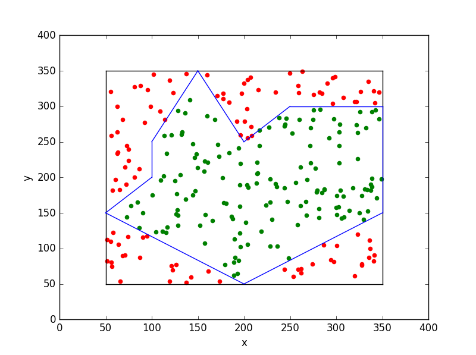
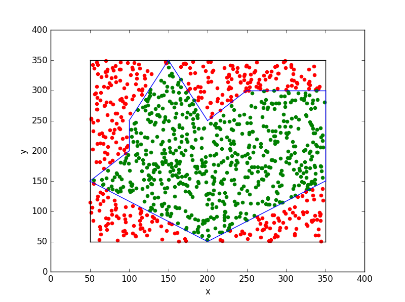
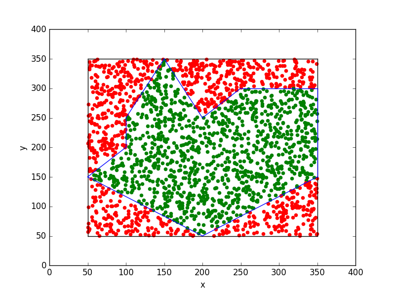
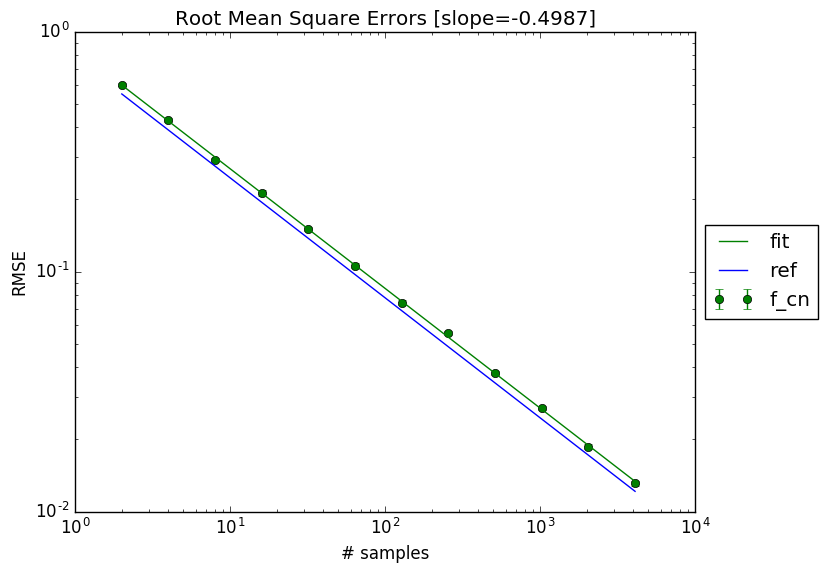
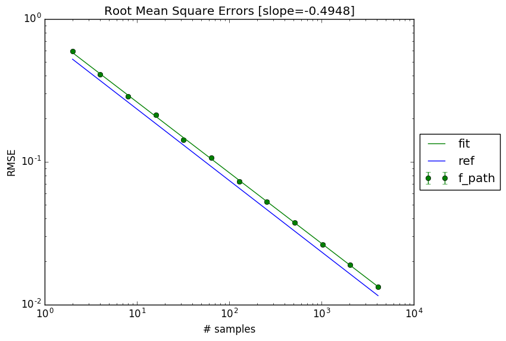

[![License][s1]][co] [![License][s2]][li]

[s1]: https://api.codacy.com/project/badge/Grade/b4b3f99be7f44698a6081b4a84e65afc
[s2]: https://img.shields.io/badge/licence-GPL%203.0-blue.svg

[co]: https://www.codacy.com/app/matt77hias/pippy?utm_source=github.com&amp;utm_medium=referral&amp;utm_content=matt77hias/pippy&amp;utm_campaign=Badge_Grade
[li]: https://raw.githubusercontent.com/matt77hias/pippy/master/LICENSE.txt

# pippy

## About
A small *point-inside-polygon* (pip) library supporting *crossing* and *winding number* pip tests.

## Use
<p align="center">




</p>
<p align="center">



</p>

### Monte-Carlo (*hit-or-miss*) convergence behaviour
#### Crossing number pip test
<p align="center">


</p>
<p align="center">16 versus 1028 experiments</p>

#### Winding number pip test
<p align="center">


</p>
<p align="center">16 versus 1028 experiments</p>

#### `matplotlib.path.Path.contains_point` pip test
<p align="center">


</p>
<p align="center">16 versus 1028 experiments</p>

```python
# Code
test.test()
```
